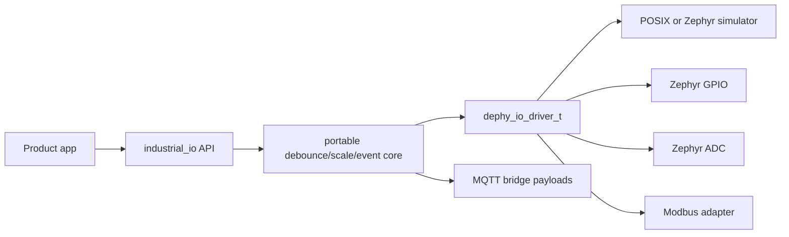
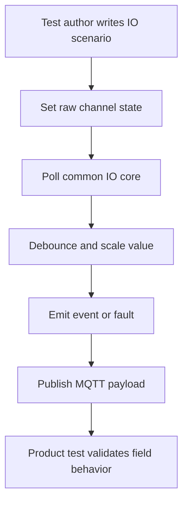

# dephy_industrial_io

Reusable industrial IO boundary for Dephy product applications.

## Overview

`dephy_industrial_io` lets product logic use one IO API while the raw signal
source changes underneath: POSIX simulator, Zephyr simulator, GPIO, ADC, or
Modbus-backed registers.

## Key Value

- Tests IO behavior on Linux before hardware is ready.
- Models raw states used by real drivers: normal, fault, stuck-at, and noise.
- Reuses debounce, scaling, event generation, fault state, and bounded payload
  formatting.
- Provides MQTT state/event/command/fault topic helpers.
- Includes Zephyr GPIO, ADC, simulator, and Modbus adapter boundaries.

## How To Use

```c
dephy_io_set_driver(my_driver);
dephy_io_init(channels, channel_count);
dephy_io_poll();
```

```sh
make -f Makefile.linux test
make -f Makefile.linux demo
make -f Makefile.linux bench
scripts/test_zephyr_module.sh --metadata-only
```

## Architecture Flow



## Example User Scenario



## Simple Principle

Drivers expose raw signal behavior. The portable core turns raw values into
stable product-facing IO state.

## Docs

- `docs/module_structure.md`: public API, adapter, and test layout.
- `docs/todo.md`: current TODO summary.

## License

MIT. See `LICENSE` and `NOTICE.md`. Reuse and references are allowed, but the
copyright notice and attribution to Judd (judadao) must be preserved.
